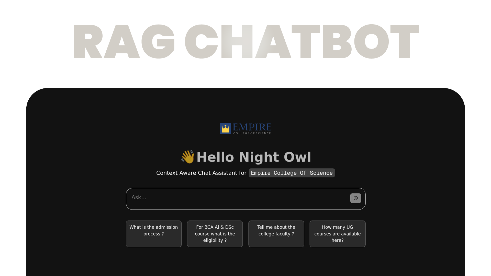

<div align="center" style="color: black;">

</div>

---

A RAG chatbot that helps college website visitors to get accurate, context-aware answers by combining retrieval-based search with generative AI.


### Do

scrap the data before start
```bash
make scrap  # to scrap data.
```

then,
```bash
make index  # add the retrived data into vector store.
```

download model locally
```bash
make download-model
```

  - About Model

|` |  `  |
|---|-|
|`Model used`    | TinyLlama-1.1b-chat-v1.0|
|`Architecture`  | LlaMa                   |
|`Quantized`     | true                    |
|`Size`          | 1.17 GB                 |


run the backend
```bash
make run-api
```

run frontend
```bash
make run-ui
```


> [!NOTE]
> All this response based on the latest [college website](https://empirecollege.in/) data.
> `Please verify important needs before proceed.`

### License
[MIT](LICENSE)
